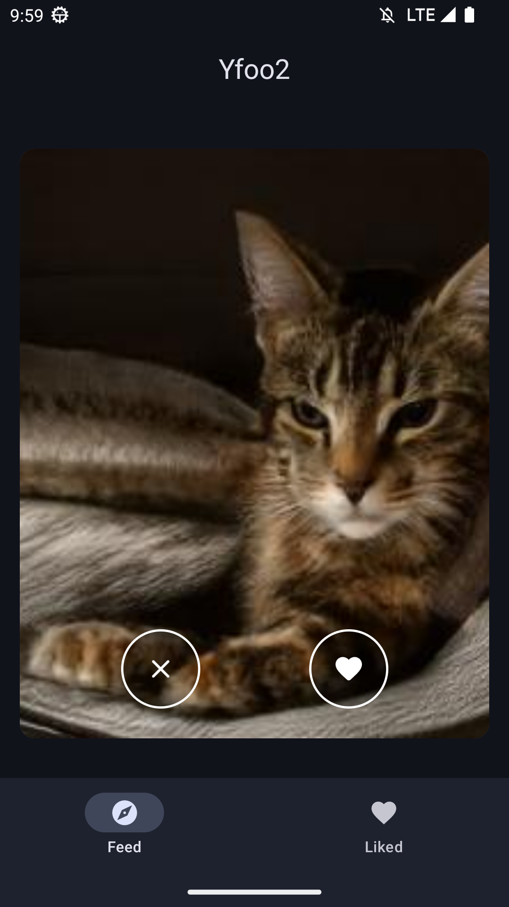
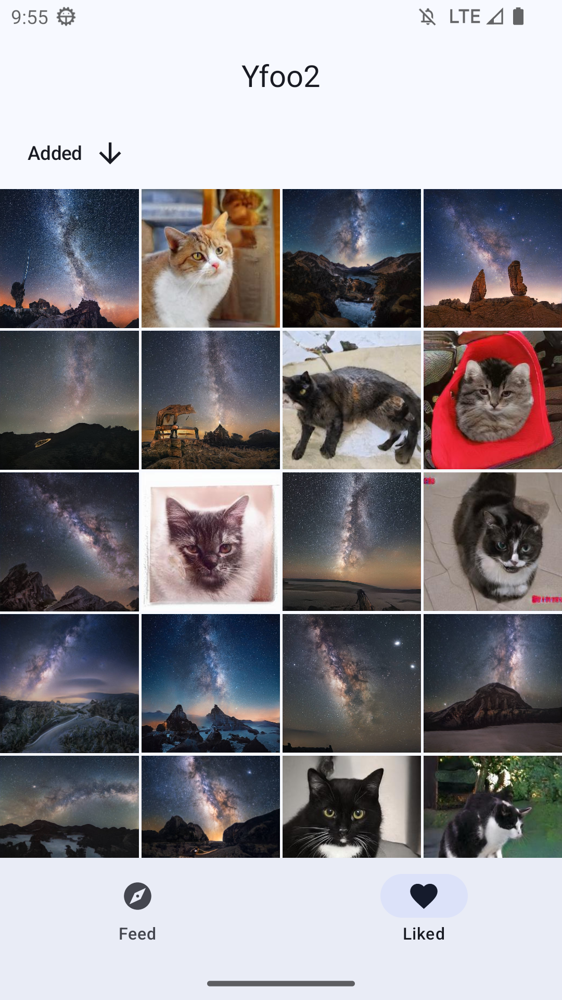

# Yfoo 2 - A Compose & MVI + Clean Architecture showcase

An Android project showcasing best practices with Kotlin and latest Jetpack libraries.

The architecture was inspired by the [Android Kotlin starter project](https://github.com/krzdabrowski/android-starter-2022), though it has been modified significantly.

### Description
This application showcases a custom Tinder-like UI designed for viewing an endless list of images. Images that are liked can subsequently be accessed on a separate screen. Utilizes images from [This Waifu Does Not Exist](https://www.thiswaifudoesnotexist.net/). Adopts offline-first approach. Supports light/dark mode and dynamic color from Material 3.

### Libraries/concepts used

* Kotlin Coroutines & Kotlin Flow
* Hilt
* Jetpack: Navigation, Room and Lifecycle
* Coil image loading library
* Material 3
* Accompanist: Navigation animation, Drawable painter and Placeholder
* KtLint and Detekt linters

     
