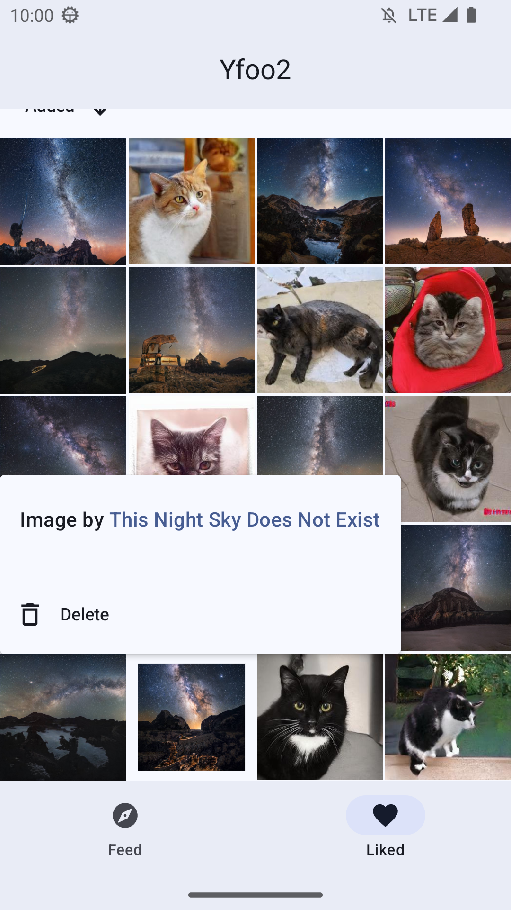

# Yfoo 2 - A Compose & MVI + Clean Architecture showcase

An Android project showcasing best practices with Kotlin and latest Jetpack libraries.

The architecture was inspired by the [Android Kotlin starter project](https://github.com/krzdabrowski/android-starter-2022), though it has been modified significantly.

  

### Description

This application showcases a custom Tinder-like UI designed for viewing an endless list of images as
a stack of swipeable cards. Images that are liked can subsequently be accessed on a separate screen.
Utilizes images
from [This Night Sky Does Not Exist](https://www.arthurfindelair.com/thisnightskydoesnotexist/)
and [These Cats Do Not Exist](https://thesecatsdonotexist.com/). Adopts offline-first approach.
Supports light/dark mode and dynamic color from Material 3.

### Libraries used

* Jetpack Compose
* Kotlin Coroutines & Kotlin Flow
* ~~Hilt~~ Koin
* Jetpack: Navigation, Room and Lifecycle
* Coil image loading library
* Material 3
* Accompanist: Navigation animation, Drawable painter and Placeholder
* SplashScreen
* Robolectric, Kotest, Compose Preview Screenshot Testing
* Compose lint checks by Slack

     
